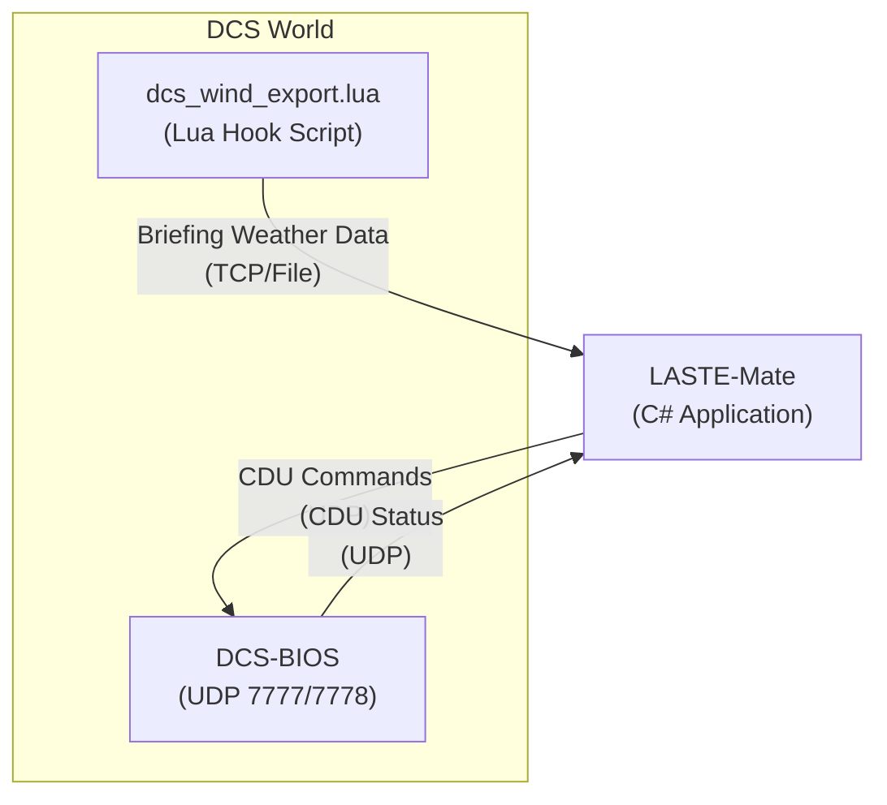

# LASTE-Mate

An [Avalonia](https://github.com/AvaloniaUI/Avalonia)-based application that replaces the other wind correction calculator for the A-10C II aircraft in DCS World. This tool automatically extracts wind data from the DCS mission briefing page, calculates the CDU wind lines needed for accurate bombing runs, and can automatically enter the data into the CDU via [DCS-BIOS](https://github.com/dcs-bios/dcs-bios).

   

## Features

- **Automatic DCS Integration**: Reads wind data directly from DCS via Lua export script
- **Connection Modes**: 
  - **TCP Socket** (Default): Automatic data reception from DCS
  - **File-based** (Alternative): Reads from JSON export file
- **Automatic CDU Data Entry**: Sends button sequences to [DCS-BIOS](https://github.com/dcs-bios/dcs-bios) to automatically enter wind data into the CDU
- **Manual Input Mode**: Enter wind data manually if DCS export is unavailable
- **Automatic Updates**: Automatically updates calculations when DCS wind data changes
- **CDU Formatted Output**: Displays results in the exact format needed for CDU entry
- **Progress Tracking**: Visual feedback with progress indicator and debug log during CDU data entry
- **Error Recovery**: Automatically detects and recovers from CDU input errors
- **Supported maps**: Includes magnetic variation data for the following maps:
   - Caucasus
   - Marianas
   - Nevada
   - Normandy
   - Persian Gulf
   - Sinai
   - Syria
   - The Channel
   - Afghanistan
   - Cold War Germany

## Roadmap

- **TCP Server Auto-start**: The TCP server does not automatically start when the application launches
- **TCP Server Process Cleanup**: Sometimes the TCP server process can get stuck and remain running after the application is closed
- **CDU Input Error Detection**: The CDU input error detection currently does not trigger for all instances where errors occur
- **UI Polish Needed**: 
  - Fonts and font sizes need to be standardized throughout the application
  - TCP port input box is too small and needs resizing
  - CDU debug log should be moved to a dedicated panel on the right side
- **Code Cleanup**: General code cleanup and refactoring needed throughout the repository

## Components

## Installation

1. Download and build the application (or use the provided executable)
2. Install the DCS Lua export script (see [Scripts/README.md](Scripts/README.md))
3. Install [DCS-BIOS](https://github.com/dcs-bios/dcs-bios) (required for automatic CDU data entry)
4. Run the application

## Usage

### TCP Socket Mode (Default)

TCP Socket mode is the default and recommended connection method. It automatically receives weather data from DCS and enables automatic CDU data entry via [DCS-BIOS](https://github.com/dcs-bios/dcs-bios).

1. **Set up the DCS export script**:
   - Copy `Scripts/dcs_wind_export.lua` to your DCS `Scripts/Hooks/` folder
   - Configure the script for TCP mode (see [Scripts/README.md](Scripts/README.md))

2. **Install DCS-BIOS**:
   - Install DCS-BIOS following the official [DCS-BIOS](https://github.com/dcs-bios/dcs-bios) documentation
   - Ensure [DCS-BIOS](https://github.com/dcs-bios/dcs-bios) is running and configured

3. **Configure the application**:
   - Select "TCP Socket" connection mode
   - Configure the TCP port (default: 10309) to match the Lua script
   - Click "Start TCP Server" to begin listening for DCS connections
   - Wait for the connection status to show "Connected" (which should happen after a mission is loaded in DCS)

4. **Start DCS and load a mission**:
   - The application will automatically receive wind data from DCS
   - Calculations update automatically, as soon as data is received
   - Make sure correct map was identified by LASTE-Mate, as the magnetic variations differ and influence the result.

5. **Send data to CDU**:
   - Click "Send Data to CDU" button
   - The app will automatically:
     - Navigate to the LASTE / WIND menu in the CDU
     - Enter all altitude data
     - Enter all wind data (BRG+SPD format)
     - Enter all temperature data
   - Monitor progress in the progress indicator and debug log
   - Use "Cancel" button to abort if needed

### File-based Mode (Alternative)

File-based mode is an alternative connection method if TCP socket isn’t possible.

1. **Set up the DCS export script**:
   - Copy `Scripts/dcs_wind_export.lua` to your DCS `Scripts/Hooks/` folder
   - Configure the script for file mode (see [Scripts/README.md](Scripts/README.md))
   - See [Scripts/README.md](Scripts/README.md) for detailed instructions

2. **Configure the application**:
   - Select "File-based (Read-only)" connection mode
   - The app will auto-detect the default DCS export path
   - If needed, manually enter the path to `wind_data.json` in the DCS Connection section
   - Enable "Auto-update from DCS" checkbox

3. **Start DCS and load a mission**:
   - The application will automatically read wind data from DCS
   - Calculations update automatically as new data is received (mission load/slot change
   - Verify the detected map is correct, as the magnetic variations differ per map and influence the result.

4. **View the results** in the CDU Wind Lines table

### Manual Mode

1. **Select your map** from the dropdown
2. **Enter ground temperature** in Celsius
3. **Enter wind data** for three altitudes:
   - Ground level (0m)
   - 2000m altitude
   - 8000m altitude
   - For each altitude, enter speed (m/s) and direction (degrees, meteorological)
4. **Click Calculate** to see the results

## Understanding the Results

The calculator produces 5 CDU wind lines at the following altitudes:
- **00 kft** (Ground level)
- **01 kft** (1000 feet)
- **02 kft** (2000 feet)
- **07 kft** (7000 feet / ~2000m)
- **26 kft** (26000 feet / ~8000m)

Each line shows:
- **Alt (kft)**: Altitude in thousands of feet
- **Bearing (°)**: Wind direction in degrees magnetic
- **Speed (kt)**: Wind speed in knots
- **Temp (°C)**: Temperature in Celsius
- **BRG+SPD**: Combined bearing and speed for CDU entry (e.g., "00015" = 000° at 15 knots)

## CDU Automation Details

When using "Send Data to CDU", the application executes a carefully sequenced series of button presses:

1. **Page & Height Setup**:
   - Navigates to SYS → LASTE → WIND menu
   - Clears existing data
   - Enters altitude fields for all 5 altitudes

2. **Wind Data Entry**:
   - Enters WNDEDIT mode
   - Enters 5-digit BRG+SPD data for each altitude
   - Handles page navigation automatically

3. **Temperature Entry**:
   - Enters 2-digit temperature data for each altitude
   - Handles negative temperatures (double-press LSK)

4. **Error Recovery**:
   - Monitors CDU_LINE9 for input errors
   - Automatically clears errors and retries failed commands
   - Releases any pressed buttons on cancellation

## DCS Export Script Setup

See [Scripts/README.md](Scripts/README.md) for detailed instructions on installing and configuring the Lua export script.

### Quick Setup

1. Navigate to: `%USERPROFILE%\Saved Games\DCS\Scripts\Hooks\` (or `DCS.openbeta\` for beta)
2. Create the `Hooks` folder if it doesn't exist
3. Copy `dcs_wind_export.lua` to this folder
4. Edit the script to configure communication mode (file or TCP)
5. The script will automatically create `wind_data.json` (file mode) or connect via TCP (TCP mode)

## Multiplayer Support

Attention, the export script works in multiplayer, but has only been tested on a private server that allows exports. An automation like LASTE-Mate may be disallowed by some servers; make sure to verify server rules!

## Troubleshooting

### DCS Connection Not Working

- **TCP Mode**:
  - Verify the TCP port matches in both the script config and LASTE-Mate
  - Make sure LASTE-Mate's TCP server is started
  - Check Windows Firewall isn't blocking the connection
  - Ensure LuaSocket is enabled in DCS (see [Scripts/README.md](Scripts/README.md))
  - Enable `debug_mode = true` in the script config to see detailed logs

- **File Mode**:
  - Check the export file path: Ensure it points to the correct `wind_data.json` file
  - Verify the Lua script is installed: Check that `dcs_wind_export.lua` is in the `Scripts/Hooks/` folder
  - Check DCS is running: The script only exports when DCS is running with a mission loaded
  - Check file permissions: Ensure the application can read the export file

### Export File Not Updating

- **Verify script is running**: Check DCS log files for Lua errors
- **Check file path**: Ensure the script is writing to the expected location
- **Restart DCS**: Sometimes the script needs a DCS restart to load

### CDU Automation Not Working

- **Check [DCS-BIOS](https://github.com/dcs-bios/dcs-bios)**: Ensure [DCS-BIOS](https://github.com/dcs-bios/dcs-bios) is installed and running
- **Verify connection**: The app must be connected via TCP Socket mode
- **Check [DCS-BIOS](https://github.com/dcs-bios/dcs-bios) port**: Default is 7778 for sending, 7777 for receiving
- **Review debug log**: Expand the debug log in the UI to see detailed command execution
- **Check for errors**: The app automatically detects and recovers from CDU input errors

### Calculation Errors

- **Check input values**: Ensure all wind speeds and directions are valid
- **Verify map selection**: Make sure you've selected the correct map
- **Check temperature**: Ground temperature should be a reasonable value (-50 to 50°C)

## Technical Details

### Calculation Logic

The calculator mirrors the Excel workbook logic:
- Magnetic variation is looked up by map name
- Bearing = Meteorological Direction - Magnetic Variation
- Speed conversion uses 1.94 m/s to knots (with special handling for 01 and 02 kft altitudes)
- Temperature uses a 2°C per 1000ft lapse rate

### Communication Protocols

- **TCP (Port 10309)**: One-way communication from the DCS Lua hook script to LASTE-Mate
  - Payload: JSON weather data from the mission briefing

- **DCS-BIOS Import**: Sends control commands to DCS-BIOS
  - Transport: UDP 7778 (default)
  - Format: `CONTROL VALUE\n` (e.g., `CDU_SYS 1\n`)

- **DCS-BIOS Export**: Receives CDU/display/status data from DCS-BIOS
  - Transport: DCS-BIOS export stream (binary; default multicast 239.255.50.10:5010, configurable via BIOSConfig.lua)
  - Used for: reading CDU lines (e.g., to detect "INPUT ERROR")

## License

This project is licensed under the MIT License - see the [LICENSE](LICENSE) file for details.

## Acknowledgements

This project would not have been possible without the excellent work and contributions from the following projects and communities:

- **[DCS-BIOS](https://github.com/dcs-bios/dcs-bios)**: An open-source project that enables bidirectional communication between DCS World and external applications. [DCS-BIOS](https://github.com/dcs-bios/dcs-bios) provides the UDP protocol interface that allows LASTE-Mate to automatically enter wind correction data into the A-10C II's CDU, making the automation features possible. The project's well-documented protocol and active community have been invaluable.

- **[JAAWCC (Just Another A-10C II Wind Correction Calculator)](https://www.digitalcombatsimulator.com/en/files/3339252/)**: Created by regiregi22, this Excel-based calculator served as the original inspiration and reference implementation for the wind correction calculations. LASTE-Mate's calculation logic is based on the methodology established in JAAWCC, adapted and enhanced with modern automation capabilities.

We extend our sincere gratitude to the developers and contributors of these projects, as well as the DCS World community for their continued support and feedback.
